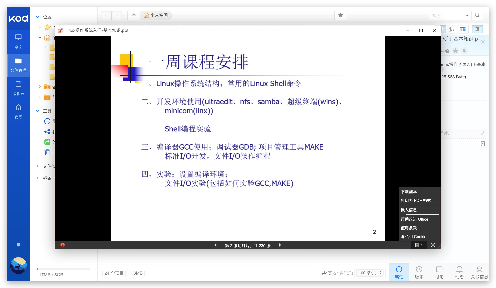

# [KodExplorer](http://www.kodcloud.com)

*可道云*KodExplorer(原芒果云)提供私有云存储/企业网盘/企业云盘和在线文档管理解决方案,助力企业实现办公协作、Office在线编辑、安全存储访问和组织权限控制。

## 部署

本项目基于开源项目 [CloudBase Framework](https://github.com/Tencent/cloudbase-framework) 开发部署，支持一键云端部署

### 配置

- 暂无

### 依赖

- CynosDB：使用 CynosDB 数据库存储数据
- CFS：使用 CFS 持久化存储数据

## 注意事项

1. 部署时，需要将服务路径设置为根路径 `/`
2. 建议使用 0.5C1G 以上的规格